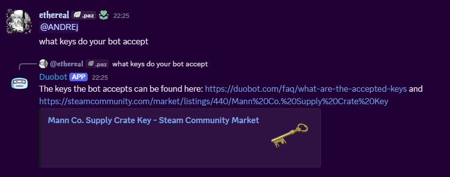
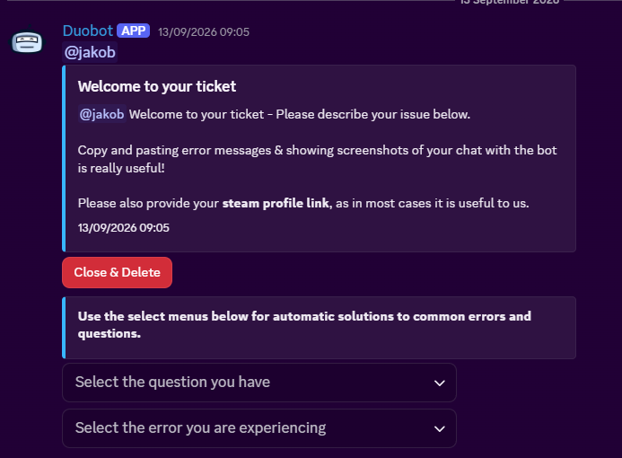
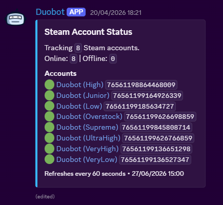

# DuobotBot

Discord bot for the Duobot server (a Steam trading-bot service, ~60,000 members), plus a small
Flask site that handles Steam account linking. It handles support tickets, answers common support
questions automatically, and syncs Steam levels to Discord roles.

**Stack:** Python 3.13, discord.py, Flask, SQLite (aiosqlite), rapidfuzz, Discord OAuth2 + Steam Web
API, deployed to a VPS with GitHub Actions, gunicorn and pm2.

## Screenshots







## What it does

- **Tickets** - button-based ticket system. Users open a ticket from a prompt message, staff can add/remove people, and tickets get archived or deleted when closed.
- **Auto responses** - watches messages in the support/community/ticket categories and replies to common questions automatically. Matching is fuzzy (rapidfuzz) so typos still work. There's a per-user cooldown and a per-response cooldown so it doesn't spam. Staff messages are ignored. Staff can also fire one manually with `/autoresp`.
- **Auto support menus** - dropdown menus with canned answers for common bot errors and FAQs.
- **Steam level roles** - users link their Steam account through the website, the bot reads their level from the database and gives them the matching `Level X` role. Roles are picked up automatically from the server by name.
- **Steam status embeds** - live embeds showing whether a list of Steam accounts is online/offline, refreshed every 60 seconds.
- **Announcements** - `/announce` opens a modal for sending embed announcements.
- Misc: deletes invite links from non-staff, `/website` for a link to the site.

## Layout

```
bot/        the discord bot
  main.py           everything - commands, tickets, tasks, events
  auto_responses.py auto response list + matching logic
  ids.py            channel/role/category IDs, colours, canned support text
web/        flask app for the steam linking flow
  app.py            discord oauth callback, pulls steam connection + level
db/
  schema.py         creates the sqlite users table
```

The bot and the website share `db/db.sqlite`. The website writes the user's Steam ID/level into it, the bot reads from it every 15 seconds and hands out roles.

## Setup

Needs Python 3.13 and a `.env` in the project root:

```
token=<discord bot token>
STEAM_API_KEY=<steam web api key>
DISCORD_CLIENT_ID=<discord app client id>
DISCORD_CLIENT_SECRET=<discord app client secret>
```

Then:

```
pip install -r bot/requirements.txt
python db/schema.py
python bot/main.py
```

The website runs separately with gunicorn (see `web/start.sh`).

## Deploying

Pushing to `main` triggers the GitHub Actions workflow in `.github/workflows/deploy.yml`, which rsyncs the project to the VPS and restarts the `duobotbot` pm2 process. `.env` and `db/` are excluded from the sync so they aren't overwritten.

## Notes

- Slash commands are synced to one guild only, the ID is hardcoded in `main.py`.
- Most IDs live in `ids.py` - if a channel or role changes, that's the file to edit.
- The SQLite path in `web/app.py` is an absolute VPS path, so the website won't work locally without changing it.
